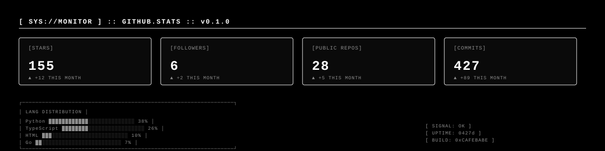

<!-- 顶部赛博朋克黑白 Banner（自渲染 SVG，GitHub 同源 100% 加载） -->

  

<!-- 自渲染打字动画（SMIL 动画，GitHub 原生支持） -->

  

 

<!-- 黑白徽章 -->

  
  
  

 

---

<!-- 自渲染黑白 Stats 卡片（不依赖外部服务） -->

  

 

---

<!-- 4 个 Pinned 仓库（卡片靠 vercel.app 渲染） -->

  
  &nbsp;
  

  
  &nbsp;
  

---

<!-- 自渲染黑白技术栈（不依赖 skillicons.dev） -->

  

---

<!-- 自渲染活动图（GitHub 原生 commit 渲染，本地生成） -->

  

---

<!-- 联系方式（极简） -->

  
  &nbsp;
  

  📡 <a href="https://github.com/shikunpneg/Oracle-Bone-Script-IME">主项目</a> · <a href="https://shikunpneg.github.io/Oracle-Bone-Script-IME/">在线 Demo</a> · <a href="https://github.com/shikunpneg/Oracle-Bone-Script-IME/releases">Release</a>

