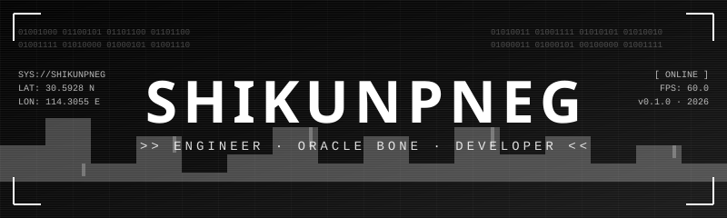

<!-- 顶部赛博朋克 Banner（黑白 SVG） -->

  

<!-- 终端扫描线状态 -->

  

 

  
  
  

 

---

<!-- Stats 面板（黑白主题） -->

  

  

---

<!-- 重点项目（已有 6 个公开仓库含 Oracle-Bone-Script-IME） -->

  
  &nbsp;
  

  
  &nbsp;
  

---

<!-- 技术栈（黑白） -->

  

---

<!-- 活动图（黑白） -->

  

---

<!-- 奖杯（黑白） -->

  

---

<!-- 联系方式（极简） -->

  

  📡 <a href="https://github.com/shikunpneg/Oracle-Bone-Script-IME">主项目</a> · <a href="https://shikunpneg.github.io/Oracle-Bone-Script-IME/">在线 Demo</a> · <a href="https://github.com/shikunpneg/Oracle-Bone-Script-IME/releases">Release</a>

  

